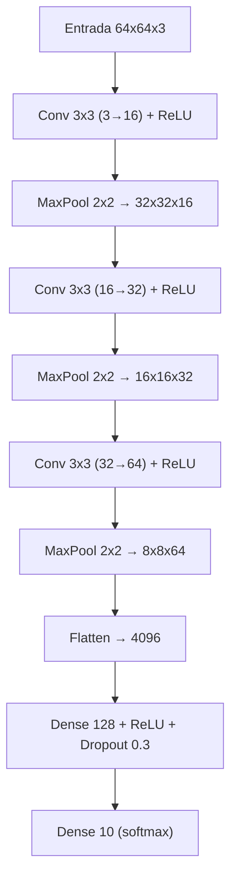
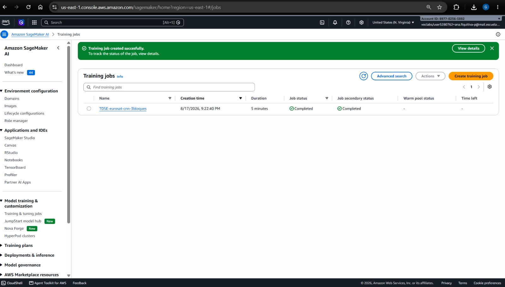
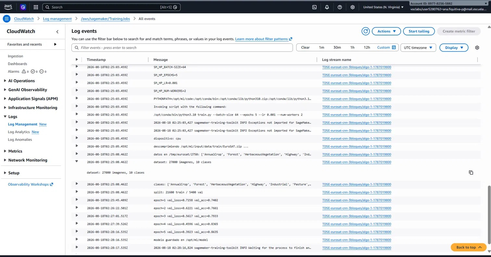

# TDSE  Explorando capas convolucionales con datos y experimentos

Trabajo del curso sobre el rol de las capas convolucionales como sesgo inductivo en redes
neuronales, usando el dataset EuroSAT (versión RGB)  Helber, P., Bischke, B., Dengel, A.,
& Borth, D. (2019). *EuroSAT: A novel dataset and deep learning benchmark for land use and
land cover classification.* IEEE Journal of Selected Topics in Applied Earth Observations and
Remote Sensing.

## Descripción del problema

El objetivo no es solo entrenar un clasificador con buen desempeño, sino usar el problema de
clasificación de imágenes satelitales como excusa para analizar, con evidencia experimental,
qué aporta una capa convolucional frente a una capa totalmente conectada, y cómo decisiones de
diseño (kernel, stride, padding, profundidad, pooling) afectan el aprendizaje.

Para eso se compara un modelo baseline sin convolución (Flatten + Dense) contra una CNN
diseñada desde cero, y se realiza un experimento controlado variando la profundidad de la
parte convolucional.

## Descripción del dataset

**EuroSAT (RGB)**: 27.000 parches de imágenes satelitales Sentinel-2, de 64×64 píxeles y 3
canales (RGB), distribuidos en 10 clases de uso/cobertura del suelo: AnnualCrop, Forest,
HerbaceousVegetation, Highway, Industrial, Pasture, PermanentCrop, Residential,
River, SeaLake. El dataset está balanceado (entre 2.000 y 3.000 imágenes por clase).

Es apropiado para capas convolucionales porque las clases se distinguen por patrones
espaciales locales (texturas, bordes, trazados geométricos) que se repiten en distintas
posiciones de la imagen  exactamente el sesgo inductivo que explota una convolución
(localidad + pesos compartidos). El detalle completo del EDA está en el notebook.

Se descarga automáticamente vía torchvision.datasets.EuroSAT(download=True), sin necesidad
de pasos manuales.

## Estructura del repositorio

```
├── notebooks/
│   └── EuroSAT_CNN.ipynb        Notebook principal: EDA, baseline, CNN, experimento, interpretación
├── sagemaker/
│   ├── train.py                  Script de entrenamiento para SageMaker (contenedor PyTorch)
│   ├── despliegue_sagemaker.ipynb  Notebook para lanzar el training job y desplegar el endpoint
│   └── requirements.txt
├── requirements.txt               Dependencias para correr el notebook principal localmente
└── data/                          Se crea al descargar el dataset (ignorado por git)
```

## Arquitectura convolucional diseñada

```
Entrada 64x64x3
  -> Conv3x3(3->16) + ReLU -> MaxPool2x2   => 32x32x16
  -> Conv3x3(16->32) + ReLU -> MaxPool2x2  => 16x16x32
  -> Conv3x3(32->64) + ReLU -> MaxPool2x2  => 8x8x64
  -> Flatten                               => 4096
  -> Linear(4096->128) + ReLU + Dropout(0.3)
  -> Linear(128->10)
```



La justificación de cada decisión (kernel, stride, padding, activación, pooling, profundidad)
está desarrollada en la Sección 3 del notebook.

## Resultados experimentales

(valores tomados de la ejecución real del notebook, 10 épocas para baseline y CNN principal;
ver notebooks/EuroSAT_CNN.ipynb, secciones 2 a 4, para las curvas completas y la matriz de
confusión)

| Modelo | Parámetros | Test accuracy | Test loss |
|---|---|---|---|
| Baseline denso (Flatten + Dense) | 3,180,170 | 0.6143 | 1.2208 |
| CNN (3 bloques convolucionales) | 549,290 | 0.8728 | 0.3978 |

La CNN supera al baseline por +25.9 puntos porcentuales de accuracy en test, usando ~5.8
veces menos parámetros.

**Experimento controlado  profundidad de la parte convolucional (1 vs. 2 vs. 3 capas)**,
manteniendo fijo kernel 3×3, stride 1, padding "same", activación ReLU, pooling 2×2,
optimizador y número de épocas (8 épocas, mismos hiperparámetros para las tres variantes):

| Profundidad | Parámetros | Tiempo de entrenamiento | Test accuracy |
|---|---|---|---|
| 1 capa | 2,099,018 | 94.1 s | 0.7736 |
| 2 capas | 1,055,082 | 131.8 s | 0.8654 |
| 3 capas | 549,290 | 141.6 s | 0.8580 |

El mayor salto ocurre entre 1 y 2 capas (+9 puntos porcentuales); entre 2 y 3 capas el
accuracy de test no mejora (incluso retrocede levemente) pese a más tiempo de
entrenamiento  evidencia directa de que la ganancia marginal de profundidad no es monótona.

## Interpretación (resumen)

- La CNN supera al baseline denso porque introduce un sesgo inductivo alineado con la
  naturaleza espacial de los datos (localidad + pesos compartidos), mientras que el baseline
  debe aprender una relación independiente para cada posición de píxel.
- El sesgo inductivo de la convolución es doble: localidad (cada neurona mira solo una
  vecindad del kernel) y equivarianza a traslación (el mismo kernel se reutiliza en toda
  la imagen).
- La convolución deja de ser apropiada cuando los datos no tienen estructura espacial/de
  vecindad significativa (datos tabulares con columnas en orden arbitrario), cuando la
  posición absoluta de una característica importa más que su aparición local repetida, o
  cuando las dependencias relevantes son de largo alcance desde el inicio.

El razonamiento completo, con más detalle y matices, está en la Sección 5 del notebook.

## Cómo ejecutar

### Notebook principal (local)

```bash
pip install -r requirements.txt
jupyter notebook notebooks/EuroSAT_CNN.ipynb
```

El dataset se descarga automáticamente en data/ la primera vez que se ejecuta el notebook.

### Entrenamiento y despliegue en SageMaker

Esta parte no se ejecuta localmente: requiere una cuenta de AWS con permisos de SageMaker.

1. Exportar los splits de train/val usados en el notebook principal a estructura
   ImageFolder (data/train/<clase>/*.jpg, data/val/<clase>/*.jpg).
2. Desde una instancia de notebook de SageMaker o SageMaker Studio, abrir
   sagemaker/despliegue_sagemaker.ipynb y ejecutar las celdas en orden: subida a S3,
   creación del PyTorch Estimator apuntando a sagemaker/train.py.


## Entrenamiento y despliegue en Amazon SageMaker

El entrenamiento y despliegue en producción de la CNN se ejecutó en Amazon SageMaker (`sagemaker/train.py` y `sagemaker/despliegue_sagemaker.ipynb`). El despliegue no se pudo realizar por politicas de AWS ACADEMY






## Bonus

El notebook incluye, al final, la visualización de los filtros aprendidos por la primera capa
convolucional y sus mapas de activación sobre una imagen de ejemplo.
